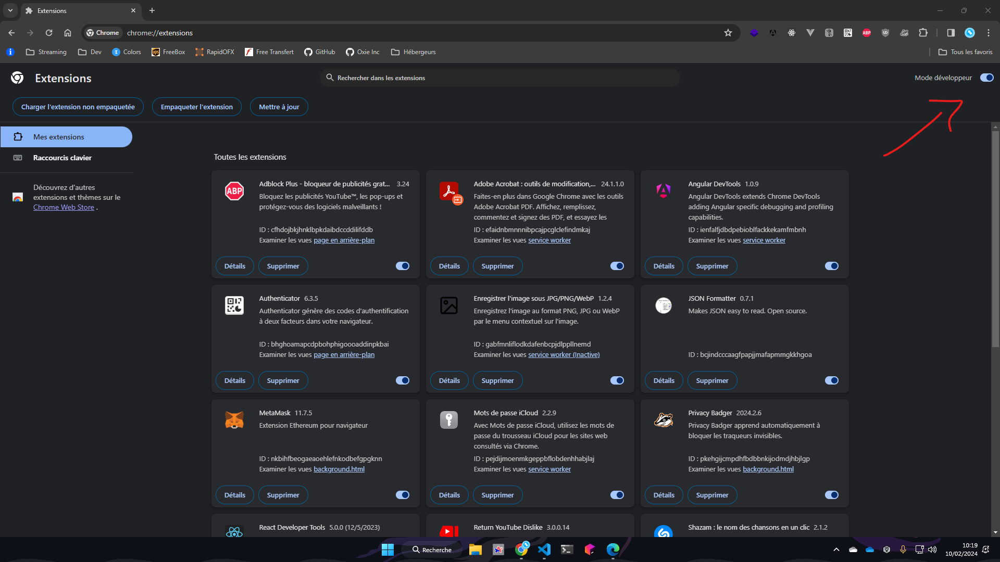

# YTRPC

🚀 A simple Discord Rich Presence client for Youtube Music.

## ⬇️ Installation

#### NPM

```bash
npm install @piarre/ytrpc
```

## :zap: Setup extension

### First step

Enable `developer mode` in a chromium based browser (chrome for me).



### Second step

Load the extension by clicking `Load unpacked` then select the folder `extension`


### Last step

Launch the server by running `ytrpc` anywhere and you should see

```bash
🚀 Connected to Discord's IPC
🚀 WebSocket Server opened on port 3012
```

Then, `reload` your Youtube Music page then it's done :sparkles:

:::tip
You can run it on background with PM2 or something else.
:::

### 🔥 [Source](https://github.com/Piarre/YTMusic-DiscordRPC)


<style>
:root img {
  border-radius: 12px;
}
</style>
